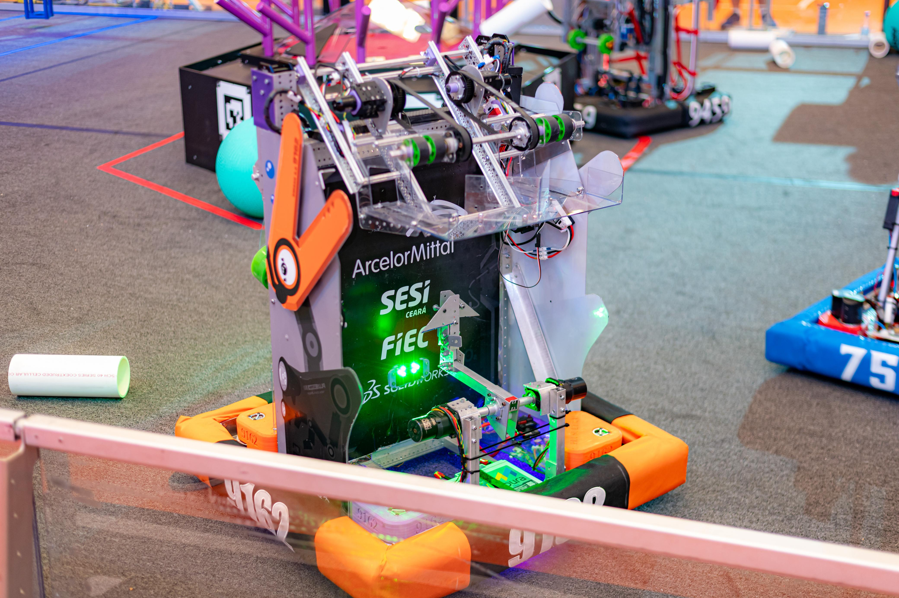

# 🤖 SMASH 4.0 — FRC 9162

  

Codebase for **SMASH 4.0**, the competition robot developed by **Team ALLMIGHT — 9162** and used during the **2025 FIRST Robotics Competition (FRC) Regional Brasília**.

This repository contains the full robot software responsible for drivetrain control, vision processing, autonomous routines, and match operation.

---

## 🏆 Robot Overview

- **Team:** ALLMIGHT — 9162  
- **Robot Name:** SMASH 4.0  
- **Competition:** FIRST Robotics Competition (FRC)  
- **Event:** Regional Brasília  
- **Language:** Java  
- **Framework:** WPILib (Command-Based)

---

## ✨ Highlights

### 🎮 Controls
SMASH 4.0 uses a command-based control architecture that cleanly separates driver input, operator control, and autonomous behavior.  
Manual control is prioritized, with automatic alignment features activating contextually during gameplay.

### 🎯 Vision
The robot uses **Limelight** cameras for **AprilTag detection and pose estimation**.  
Vision data is fused with odometry to enable:
- Automatic target alignment  
- Speed reduction near scoring targets  
- Consistent positioning during autonomous and teleoperated periods  

### 🧭 Autonomous
Autonomous routines are built using **PathPlanner**, allowing reliable and repeatable trajectories.  
The system supports precise path following while maintaining heading stability and smooth transitions at the end of paths.

---

## 📦 Code Structure
- **Subsystems** are self-contained and reusable  
- **Commands** encapsulate robot behavior  
- **RobotContainer** manages bindings, defaults, and system integration  

---

## 👁️ Vision System

- Dual Limelight setup (front and rear)
- AprilTag-based alignment
- Uses `tx`, `ta`, and pose estimation
- Automatic correction without driver button input

---

Developed and maintained by the **Team ALLMIGHT — 9162 Software Team**  
Software Leads:

- **[Rafael Henritzi](https://github.com/henritzi)**  
- **[Niord Miranda](https://github.com/ProgramadorNiord)**
- **[João Santos](https://github.com/JoaoAntonio18)**
